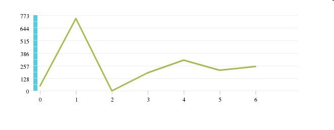
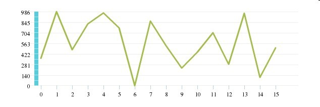

## as3实现的折线统计图

__目的__: 实时，动态的监控图表！

## Features

1. y轴分组采用标准差计算数据的离散程度，再利用相对标准差进行分组数目选择
2. x轴采用动态时间间隔，从1s-59s；1min-59min.....
3. y轴数据最低值减少20%，最高值增加10%显示
4. 区域大小可定制
5. 支持多组数据的显示

## Demo

## 2013-08-30更新

本次主要更新了x轴坐标的算法，可以根据数据源的时间间隔动态选择合适的数据分组间隔

